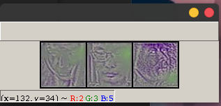

# Learning Generalized Spoof Cues for Face Anti spoofing

This is an unofficial code for the paper "Learning Generalized Spoof Cues for Face Anti spoofing" in pytorch.

I train the model using our own dataset. The classification accuracy is good but the visualization is not as good as the paper states.

## Install

```cmd
pip install torch torchvision tqdm albumentations
```

## Usage

First, make a dir containing positive and negative folder and place the corresponding image in the folder. 

Second, configure data path in dataset.py .

Then run training

```cmd
python train.py
```

For visualization,

```cmd
python demo.py
```

The visualization effect is as shown in the figure:



It will print the classification score at the same time.

## Contributing

PRs accepted.

## License

MIT © Aoru xue
